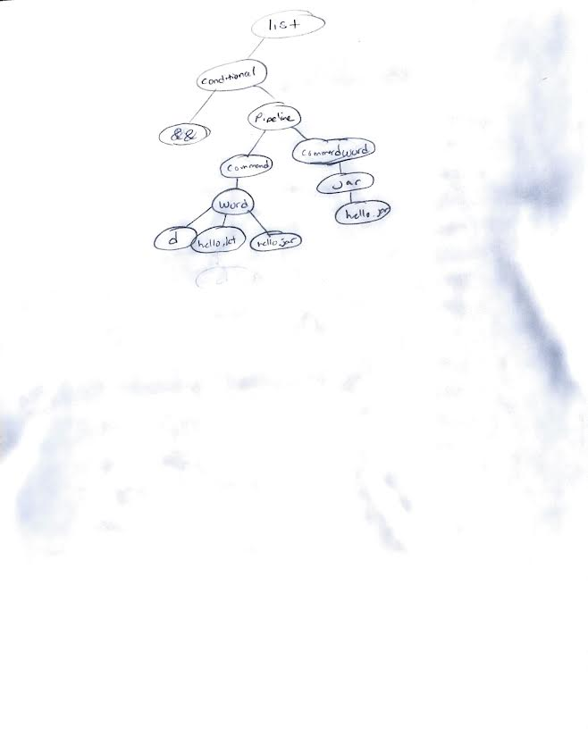
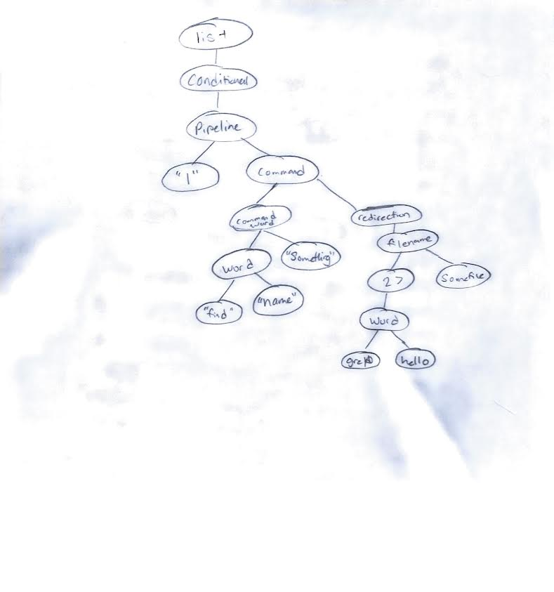

# Angie Bui

# Assignment 6 - Kotlin

syntax processing with AST Tree and kotlin program that will take in 1 command line argument containing a list of names and map them. For each set of initials entered on the console print out corresponding name.

## Running
1. Open the file 'Assignment 6' in IntelliJ IDEA

To add command line: 
In IDEA's menu bar at the top, click Run -> Edit Configurations
click the + icon.
In the Add New Configuration list, select Application.

Main class: MainKt

Program arguments: SampleFile_A6.txt

2. Hit green triangle to run

# 
# Part 2- Syntax Processing
##  2a
| Production | Derivation |
|---|------|
| 1 | list |
| 2 | conditional |
| 3 | conditional "&&" pipeline |
| 4 | pipeline "&&" pipeline |
| 5 | command "&&" pipeline |
| 6 | command word "&&" pipeline |
| 6 | command word "hello.kt" "&&" pipeline |
| 6 | command word "hello.jar" "hello.kt" "&&" pipeline |
| 6 | command "d" "hello.jar" "hello.kt" "&&" pipeline |
| 6 | word "d" "hello.jar" "hello.kt" "&&" pipeline |
| 6 | "kotlinc" "d" "hello.jar" "hello.kt" "&&" pipeline |
| 4 | "kotlinc" "d" "hello.jar" "hello.kt" "&&" command |
| 6 | "kotlinc" "d" "hello.jar" "hello.kt" "&&" command word |
| 6 | "kotlinc" "d" "hello.jar" "hello.kt" "&&" command word "hello.jar" |
| 6 | "kotlinc" "d" "hello.jar" "hello.kt" "&&" command jar hello.jar |
| 6 | "kotlinc" "d" "hello.jar" "hello.kt" "&&" word jar hello.jar |
| 6 |  kotlinc d hello.jar hello.kt && java jar hello.jar |

## 2b
| Production | Derivation |
|---|------|
| 1 | list |
| 2 | conditional |
| 3 | pipeline |
| 4 | pipeline "|" command |
| 5 | command word "|" command |
| 5 | command word "something" "|" command |
| 5 | word "name" "something" "|" command |
| 5 | "find" "name" "something" "|" (command redirection) |
| 6 | (find name something) "|" (command( redirection filename)) |
| 6 | (find name something) "|" (command( "2>" somefile)) |
| 5 | (find name something) "|" ((command word)"2>" somefile) |
| 5 | (find name something) "|" ((word hello)"2>" somefile) |
| 5 | (find name something) "|" (grep hello "2>" somefile) |
