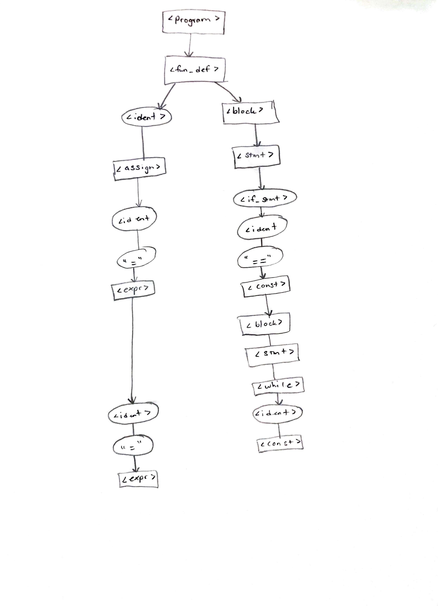
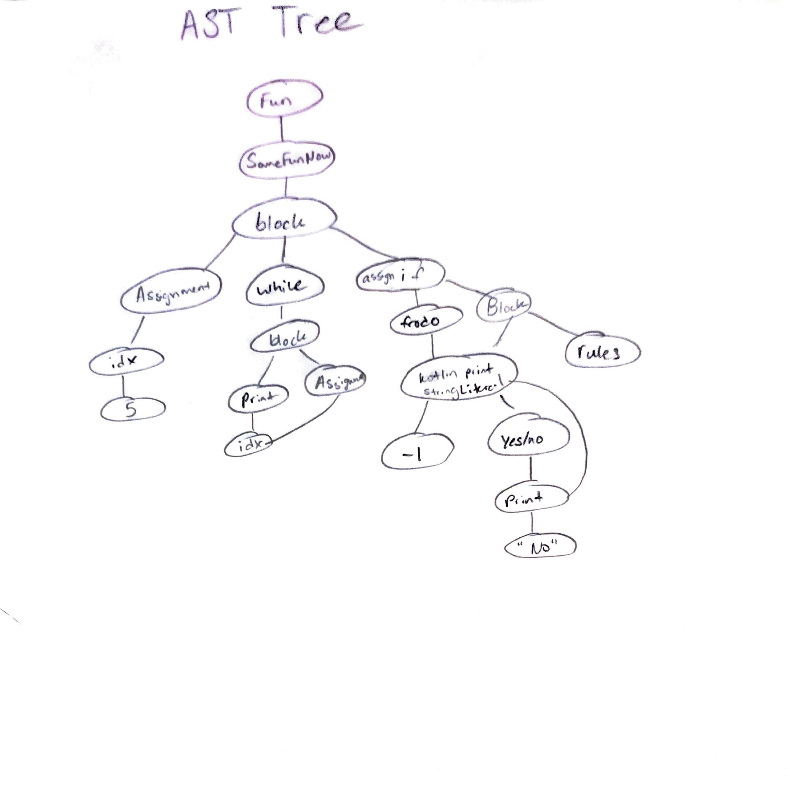

# Angie Bui

# Assignment 7 - AST and Kotlin 

# Part 2- Syntax Processing
##  2a

## 2b 
<fun> -> "fun" <ident> <block>
<block> -> "{" { <stmt> } "}"
<stmt> -> <assignment_stmt>
| <while_stmt>
| <if_stmt>
| <fn_call>
<assignment_stmt> -> <ident> "=" [<ident> ("+" | "-")] <const>
<while_stmt> -> "while" "(" <ident> <relop> <const> ")" <block>
<if_stmt> -> "if" "(" <ident> <relop> <const> ")" <block> [ "else" <block> ]
<fn_call> -> <ident> "(" <const> ")"
<ident> -> "SomeFunNow"
| "idx"
| "frodo"
| "print"
<const> -> 5
| 0
| 1
| "Kotlin rules"
| <ident>
<relop> -> ">="
| "=="
| "!="

## 2c

#

# Part 3
## Running
1. Open the file 'asn7' in IntelliJ IDEA

To add command line: 
In IDEA's menu bar at the top, click Run -> Edit Configurations
click the + icon.
In the Add New Configuration list, select Application.

Main class: MainKt

Program arguments: testing hello world

2. Hit green triangle to run
Mean word length: 5.666666666666667
Standard deviation: 0.9428090415820634